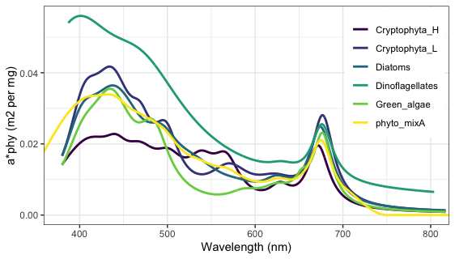

```{r setup, include=FALSE}
knitr::opts_chunk$set(echo = FALSE, message = FALSE, eval = FALSE)
```

```{r}
library(glue)
library(tidyverse)
library(readxl)
library(lubridate)
```

```{r}
my_aq_site <- "BLWA"
my_aop_yr <- "2017"
my_loc_type <- 'buoy.c0'
```

# Measured Reflectance Spectra

**helpful links**

* https://oceancolor.gsfc.nasa.gov/atbd/
* https://oceancolor.gsfc.nasa.gov/atbd/rrs/
* https://oceancolor.gsfc.nasa.gov/docs/technical/#WP
* https://www.usgs.gov/core-science-systems/nli/landsat/landsat-collection-1-surface-reflectance
* http://snr.unl.edu/agmet/brdf/brdf-definition.asp
* https://dnr.wisconsin.gov/topic/lakes/clmn/remotesensing/futuredirections.html
* http://www.eo4geo.eu/training/fundaments-of-optical-remote-sensing/

### Some definitions:

**Reflectance** (dimensionless) at depth z is upwelling irradiance (flux per unit surface area) over downwelling irradiance:

$$R(\lambda, z) = \frac{E_u(\lambda, z)}{E_d(\lambda, z)}$$


**Scalar irradiance** $(E_0)$ is the flux received by a spherical collector from all directions. This concept (how flux varies by direction) is needed to account for the portion of the signal that the sensor sees compared to all of the water-leaving irradiance.

**Radiance** measures flux per unit area and per unit solid angle. $L(\theta, \phi)$ is the radiance in direction of zenith (vertical) angle $\theta$ and azimuth (horizontal) angle $\phi$. Integrate $L$ over the appropriate angles to get **irradiance**. 

**Remote sensing reflectance** ($sr^-1$) uses upwelling radiance instead of irradiance and is defined as:

$$R_{RS}(\theta, \phi, \lambda, 0) = \frac{L(\theta, \phi, \lambda, 0)}{E_d(\lambda, 0)}$$
A proportionality factor $Q(\theta, \phi, \lambda)$ in units of [sr] can relate $R_{RS}$ to $R$. (also called the light distribution factor).

Reflectance at water surface is a function of backscattering coefficient and absorption coefficient:

$$R(0) = f \frac{b_b}{(a + b_b)}$$

**Gordon et al 1975, 1998** model for remote sensing reflectance just below the water surface:

$$r_{rs}(\lambda) = \frac{L_u(0^-,\lambda)}{E_d(0^-,\lambda)} = g_1\bigg(\frac{b_b(\lambda)}{a(\lambda) + b_b(\lambda)}\bigg) + g_2\bigg(\frac{b_b(\lambda)}{a(\lambda) + b_b(\lambda)}\bigg)^2$$
NEON measurements are non-dimensional reflectance. Get **surface remote sensing reflectance** (in [$sr^{-1}$]) dividing by pi:

$$R^w_{RS} = \frac{\rho_w}{\pi}$$

$\pi$ is the light distribution factor ($Q = \frac{E_u}{L_u}$ [$sr^{-1}$]), assuming an *isotropic light field*, where light is reflected evenly in all directions: 


Remote sensing reflecatance at the surface ($R_{rs}$) can be related to the subsurface $r_{rs}$ as (Mobley 1994, Lee et al 1998):

$$R_{rs} = \frac{\zeta \cdot r_{rs}(\lambda)}{1 - \Gamma \cdot r_{rs}(\lambda)} + R^{surf}_{rs}(\lambda) $$

* $\zeta$ is the water-to-air divergence factor, approx 0.52

* $\Gamma$ accounts for the effects of internal reflection from the water surface,  approx 1.6

* $R^{surf}_{rs}(\lambda)$ is reflections at the water surface (glint)

* $R_{rs}(\lambda)$ (in $sr^{-1}$) is defined as the upwelling radiance 
emerging from the water column divided by the downwelling irradiance 
reaching the water surface

* $R_{rs}(0-)$ is just below water surface
* $R_{rs}(0+)$ is just above water surface

Air-sea interface transfer coefficients from Lee et al 1999:

$$R_{rs}(0+) = \frac{0.52 \times R_{rs}(0-)}{1-1.7 \times R_{rs}(0-)}$$


Austin 1980 proposed the factor **0.544** for relating radiance 
just above the surface with radiance just below the surface. 

Austin, R.W., 1980. Gulf of Mexico, ocean-colour surface-truth measurements. Boundary-Layer Meteorol. 18, 269-285.

```{r}
spectra_dir <- "/Volumes/hondula/DATA/spectra_buff5m"
spectra_file <- fs::dir_ls(spectra_dir, regexp = glue("{my_aq_site}_{my_aop_yr}"))

spectra_df <- read_csv(spectra_file)
my_spectra_pt <- spectra_df %>% filter(my_cellid)

rrs <- spectra_df %>%
  ggplot(aes(wavelength, reflectance/pi)) +
  geom_line(aes(group = cell)) +
  geom_line(data = my_spectra_pt, col = "green", lwd = 1) +
  theme_bw() +
  coord_cartesian(ylim = c(0, 0.1)) +
  theme(legend.position = "none")
rrs + ggtitle(glue("Measured reflectance at {my_aq_site} {my_loc_type} {my_aop_yr}"))

```

```{r}
my_wavelengths_rs <- my_spectra_pt$wavelength
range(my_wavelengths_rs)
```

* Shape of reflectance spectra could be qualitatively compared to optical water 
typologies proposed by **Spyrakos et al 2018 L&O**

* Chl retrieval algorithms make use of chl absorption peaks at 442, 665,
and reflectance peak around 700 nm from min sum of total absorb.

> TODO: figure out min acceptable wavelengths in Rrs data

> TODO: Extract longer wavelengths for glint removal

> TODO: BLUE 2017 (spectra S2 point in the tree canopy)

> TODO: reflectance at stream sites. optically shallow?

For optically shallow waters, would also need bottom depth and bottom albedo,  and diffuse attentuation coefficient ($K$).
See eg. Albert and Mobey 2003 equations

Measured reflectance spectra need to be corrected for air-water interface and normalization of $R^{+}_{rs}$ to zenith illumination and viewing geometry to get **normalized water-leaving reflectance**: $[R_w]_N$


## Surface factor 

> TODO: investigate using PAR above and below surface

$K_d$ is an apparent optical property, diffuse attenuation under water, that depends on viewing/illumination geometry. PAR and uPAR (underwater PAR) comparison could potentially be used to separately estimate $a(\lambda)$ and $b_b(\lambda)$.

Gordon 1989 model: 

$$K_d(\lambda) = \kappa \bigg(\frac{a(\lambda) + b_b(\lambda)}{cos\theta'_{sun}}\bigg)$$
$\kappa \approx 1.0546$
$\theta'_{sun}$ is sun zenith angle in water

Lee 2005 model: 

$$K_d(\lambda) = m_0\cdot a(\lambda) + m_1(1 - m_2 e^{-m_3 \cdot a(\lambda)})(b_b(\lambda))$$
$m_0 = 1 + 0.005 \cdot \theta_{sun}$ (sun zenith angle in air)
$m_1 = 4.18$, $m_2 = 0.52$, $m_3 = 10.8$

## Solar zenith angle

Eqn. 4.2 describes irradiance reflectance just below water surface,
function of total absorption, total backscattering, and *C* which
depends on solar zenith angle. *C* is a function of the cosine of the
zenith angle of refracted photons ($\mu_0$). 

$C(\mu_0) = -0.629\mu_0 + 0.975$

```{r}
zenith_dir <- "/Volumes/hondula/DATA/zenith-angles"
zenith_file <- fs::dir_ls(zenith_dir, regexp = glue("{my_aq_site}_{my_aop_yr}"))

zenith_df <- read_csv(zenith_file)
my_zenith_pt <- zenith_df %>% filter(my_cellid)
my_zenith_pt$to_sensor_zenith_angle
mu0 <- cos(my_zenith_pt$to_sensor_zenith_angle)
mu0
```

# SUN GLINT REMOVAL

The reflectance value of interest for aquatic purposes is the ratio
of water leaving radiance to downwelling planar irradiance:

$R_{rs} = \frac{L_w(0^+)}{E_d(0^+)}$

Sensor measurement is upwelling radiance $L_u$, which includes
both $L_w$ and reflected radiance from the water surface $L_r$ which
has not interacted with the water column and needs to be removed. 

$L_u = L_w + L_r$

The remote sensing ratio is $r_{rs} = \frac{L_u(z)}{E_d(z)}$


Based on idea that residual radiance in NIR (around 700 - 1000 nm) 
is from glint, because water leaving reflectance from bottom 
and water column ($R_w = R_b + R_c$) should be negligible. 
Difficult to meet this assumption (deep enough waters) in rivers. 

* Hochberg et al 2003 method gets relative glint intensity from 
darkest and brightest pixels in NIR scaled by absolute glint intensity
in each visible band. This is sensitive to outliers and requires
masking land and clouds. Not good for water < 2 m where zero water
leaving radiance in NIR is not valid, i.e. overcorrects shallow water 
imagery. Essentially models a constant NIR brightness to be removed. 

* **Hedley et al 2005** assumes a linear relationship between a NIR band and 
each visible band to remove glint contribution. Establish a regression
between NIR brightness and amount of sun glint in each visible band. 
First, select area with visible sun glint but deep water where underlying
spectral brightness should be constant. Then for each $\lambda$ in visible,
regress NIR brightness to visible band brightness. Get Minimum NIR value
of image/sample, and calculate deglinted for band $i$ Rrs via slope $b_i$: 

$R_i^\prime = R_i - b_i(R_{NIR} - Min_{NIR})$

Need to make sure there are no non-submerged areas. Overstreet and 
Legleiter use the 5% of NIR values in deep water subset to get 
$R_{min}$ (min NIR)

* Kutser et al 2009 assume glint at 760 nm, and the depth of the absorption
feature at 760 nm is proportional to sun glint (no sun glint or oxygen 
absorption feature when NIR is all attenuated in water, but contaminated
pixels will have feature proportional to the intensity of glint):

$D = \frac{R(739) + R(860)}{2} - R(760)$

* The upwelling radiance spectra will increase dramatically due to glint
when sun is low (zenith angles are beyond 60 degrees). 

# In situ data 

Overlaps between in situ data and flights are determined in `10-overlaps`

> TODO: Sensor to in situ regressions for chl a, turbidity, fDOM

> TODO: Use phyto taxonomy to estimate proportion of algal divisions

```{r}
aos_df <- fs::dir_ls("results/overlaps", regexp = glue("*{my_aq_site}{my_aop_yr}")) %>%
  map_df(~read_csv(.x))
```

# Water Properties

* Use `approx` to interpolate published spectra to 1 nm.
* Assume backscattering is half of scattering coefficient

$b_{b,w} = 0.5 b_w$


* more absorption data and links compiled [here](https://omlc.org/spectra/water/abs/) 
* Pope and Fry 1997 absorption 380-700 nm at 2.5 nm res,
also with standard deviations
* Comparison plot (Figure 10) to Buiteveld et al, Tam and Patel, Smith and Baker, and Sogandares and Fry
* Buiteveld 1994 (absorption AND scattering 300-800 nm)
* More absorbance data in Fewell?

* Buiteveld et al 1994 Table 1 has absorption and scattering coefficients at 20 C, also a proposed temperature dependence (A = absorption increment due to temperature) 

* Bukata CRC book table 4.1 (absorption and scattering 250-800 nm)
* Optical properties of pure water from multi-author Optics of the Ocean (Russian) 1983 and Smith and Baker 
* Sogandares and Fry 1997 (Absorption and uncertainty for 10 nm increments 340 to 640 nm)
* H.Buiteveld, J.H.M. Hakvoort, and M.Donze, "The optical properties of pure water," in Ocean Optics XII, Proc. SPIE 2258, 174-183 (1994). 

> TODO: consider using temperature dependence for water spectra?

```{r}
water3 <- read_excel("../../data/water-spectra/water-spectra-buiteveld94.xlsx")

abs_water <- approx(water3$lambda_nm, 
                    water3$absorption_m1, 
                    xout = 300:800) %>% as.data.frame() %>%
  rename(wl = 1, absorb_m1 = 2)
    
# abs_water = data.frame(wl = water3$lambda_nm,
#                        absorb_m1 = water3$absorption_m1)

backs_water <- approx(water3$lambda_nm, 
                    water3$scattering_m1, 
                    xout = 300:800) %>% 
  as.data.frame() %>%
  mutate(backs_m1 = 0.5*y) %>%
  rename(wl = 1) %>%
    dplyr::select(wl, backs_m1)

# abs_water %>% 
#   left_join(backs_water) %>% write_csv("data/water-approx1nm.csv")

# backs_water = data.frame(wl = water3$lambda_nm,
#                          backs_m1 = 0.5*(water3$scattering_m1))

water_df <- read_csv("data/water-approx1nm.csv")

aa <- ggplot(abs_water, aes(x = wl, y = absorb_m1)) + 
  scale_y_log10() +
  # geom_ribbon(aes(xmin = min(my_wavelengths_rs),
  #               xmax = max(my_wavelengths_rs)),
  #           fill = "green", alpha = 0.2) +
  geom_line() +
  # geom_vline(aes(xintercept = min(my_wavelengths_rs))) +
  # geom_vline(aes(xintercept = max(my_wavelengths_rs))) +
  ggtitle("Aborption by water (Buiteveld 94)") + theme_bw()

bb <- ggplot(backs_water, aes(x = wl, y = backs_m1)) + 
  # geom_ribbon(aes(xmin = min(my_wavelengths_rs),
  #               xmax = max(my_wavelengths_rs)),
            # fill = "green", alpha = 0.2) +
  geom_line() + 
  # geom_vline(aes(xintercept = min(my_wavelengths_rs))) +
  # geom_vline(aes(xintercept = max(my_wavelengths_rs))) +
  ggtitle("1/2 scattering by water (Buiteveld 94)") + 
  theme_bw()

g1 = 0.949 # eqn 8.1
g2 = 0.794 # eqn 8.1
water_df <- water_df %>%
  mutate(u = (backs_m1/(absorb_m1 + backs_m1))) %>%
  mutate(rrs = g1*u + g2*u^2) %>%
  mutate(Rrs = (0.52 * rrs)/(1-1.6*rrs)) %>%
  mutate(Rrs2 = (0.54*rrs)/(1-1.7*rrs))

uu <- ggplot(water_df, aes(x = wl, y = u)) +
  geom_line() +
  geom_line(aes(y = rrs), col = 'red') +
  geom_line(aes(y = Rrs), col = 'blue') +
  geom_line(aes(y = Rrs2), col = 'blue', lty = 2) +
  ylab("Rrs (sr-1)") +
  ggtitle("u = black, rrs = red, Rrs = blue (no glint)") + 
  theme_bw()
uu

cowplot::plot_grid(aa, bb, uu, ncol = 1)
ggsave('figs/pure-water-rrs.png', width = 4, height = 7)

```

Plots also show range of reflectance data

```{r}
# converting to lists 
abs_water_list <- dplyr::select(abs_water, absorb_m1) %>%
  purrr::transpose(.names = glue('wl{abs_water$wl}')) %>%
  purrr::map(~as.numeric(unlist(.x)))
# abs_water_list$wl300
# 
backs_water_list <- dplyr::select(backs_water, backs_m1) %>%
  purrr::transpose(.names = glue('wl{backs_water$wl}')) %>%
  purrr::map(~as.numeric(unlist(.x)))
# 
# backs_water_list$wl300

# crop wavelengths for water to range of reflectance data
# (only affects low end)
my_wavelengths_water <- abs_water %>% 
  filter(wl %in% seq(range(my_wavelengths_rs)[1], 
                     range(my_wavelengths_rs)[2])) %>%
  pull(wl)

```


# Absorbance

* Total absorbance is sum of water, CDOM, phytoplankton, and detritus 
(non-algal portion of total suspended material)

$a_{tot}(\lambda) = a_{w}(\lambda) + a_{CDOM}(\lambda) + a_{phy}(\lambda) + a_{NAP}(\lambda)$

## Phytoplankton Absorbance

* Primary and secondary absorption maxima: 442 nm, 665 nm **Bricaud et al 1995**
* around 625 for phycocyanin (cyanobacteria) and 675 for chl a
* Peak near 700 nm (from combination of high absorbance of chl a and NIR $a_w$) 
commonly used to estimate chl a concentration. Magnitude of peak increases 
and position shifts toward longer wavelengths with increase of chl a 
concentration
* Some models assume that at 665 nm the total absorption is entirely from 
phytoplankton so $a_{t-w}$ can be used to estimate chl a concentration

Absorption spectra of phytoplankton are complex due to the mixtures
of pigments and associated proteins. Derivative analysis of spectral
curves helps separate absorption of chl a from accessory pigments. This
helps find absorption maxima wavelength positions to attribute to certain
photosynthetic pigments

chl conc (ug/L) * specific absorption (m2/mg)

Unit conversion: m2/mg * ug/L = 1/m

chla = sum of chl a AND pheophytin (Albert and Mobley 2003)

specific absorption coefficients from Gege WASI program



> TODO: Use taxonomy info for separate peaks?

* diatoms - Aguirre-Gomez et al 2001 describe molar proportion of pigments
as: (1/2)(3 Chla + 1 Chlc) + fucoxanthin + beta-carotene

* green algae - Aguirre-Gomez et al 2001 describe molar proportion of pigments
from Kork 1983 3:1 chla to chlb, 1:3 carotenoids to chla+b:
(3)(1.6 chla + 1 chlb) + beta-carotene

* Aguirre-Gomez et al 2001 table 1 has position of peaks of pigments for
diatoms, green algae, chl a, chl b, chl c1, chl c2, beta-carotene, 
fucoxanthin

> TODO: Separate peaks for chla vs pheophytin?

Phaeopigments are partial degradation products of chlorophyll. Absorb
more strongly at 412 nm, whereas chl absorbance peaks are 443 nm and 
low absorbance at 412

Babin et al 2003 found that in some coastal areas (europe) high 
pheopigment concentrations gave rise to especially high blue-to-red
ratio of phytoplankton absorption - a departure from general trend
usually found for open oceanic waters for relationship between phytoplankton
absorption and chlorophyll concentration

> TODO: Investigate Packaging effect: see Equation 2.39 (Bricaud et al 1995) 

> TODO: Estimate at time of flight using chl a sensor data?

This data is the farthest in time from flights (> 1 month)

```{r}
chla_df <- aos_df %>% filter(analyteid == "chla")
chla_mgL <- chla_df$analyteConcentration %>% sum()
chla_ugL = chla_mgL/1000
chla_mgL

astarPHY <- read_csv("data/gege-wasi-spectra.csv")

astarPHY %>%
  pivot_longer(cols = 2:7, names_to = "class", values_to = "abs_m2_per_mg") %>%
  ggplot(aes(x = nm, y = abs_m2_per_mg)) +
  geom_line(aes(col = class), lwd = 1) +
  theme_bw() +
  coord_cartesian(xlim = c(380, 800)) +
  theme(legend.title = element_blank()) +
  scale_color_viridis_d() +
  xlab("Wavelength (nm)") +
  ylab("a*phy (m2 per mg)") +
  geom_vline(aes(xintercept = min(my_wavelengths_water))) +
  geom_vline(aes(xintercept = max(my_wavelengths_water))) +
  theme(legend.position = c(0.99,0.99), legend.justification = c(1,1)) +
  ggtitle("Chl-a specific absorption coefficients")

```

```{r}
# my_wavelengths_water
astarPHY_df <- astarPHY %>% 
  dplyr::filter(nm >= min(my_wavelengths_water),
                nm <= max(my_wavelengths_water)) %>%
  dplyr::select(nm, phyto_mixA) %>%
  mutate(abs_phy = phyto_mixA*chla_ugL)

# astarPHY_df %>%
#   ggplot(aes(x = nm, y = abs_phy)) + geom_line()

# abs_phy <- astarPHY_df %>%
#   dplyr::select(abs_phy) %>% 
#   purrr::transpose(.names = glue('wl{astarPHY_df$nm}')) %>%
#   purrr::map(~as.numeric(unlist(.x)))
```

Model from Lee et al 1998

$a_{\phi}(\lambda) = \big[ a_0(\lambda) + a_1(\lambda) \times ln(a_{\phi}(440)) \big] a_{\phi}(440)$

$a_{\phi}(440) = 0.06 \times [chla]^{-0.65}$

chlorophyll a concentration, mg/m3 

```{r}
leet2 <- read_csv('data/lee1998-t2_phy_abs_coeffs.csv')

abs440 = 1

lee_spectra <- leet2 %>%
  dplyr::mutate(absorb1 = (a0 + a1*log(abs440))*abs440,
                absorb2 = (a0 + a1*log(0.5))*0.5,
                absorb3 = (a0 + a1*log(2))*2)

lee_spectra %>%
  ggplot(aes(x = wavelength, y = absorb1)) +
  # geom_line() +
  geom_point() +
  # geom_line(aes(y = absorb2), col = 'blue') +
  geom_point(aes(y = absorb2), col = 'blue') +
  # geom_line(aes(y = absorb3), col = 'red') +
  geom_point(aes(y = absorb3), col = 'red') +
  theme_bw() +
  ggtitle('absorbance at abs440 = 0.5, 1, 2')

# y <- lee_spectra$absorb1
# x <- lee_spectra$wavelength
# x <- 390:720
approx(x, y, xout = 390:720) %>% as.data.frame()
# plot(x, y, main = "approx(.) and approxfun(.)")
# points(approx(x, y, xout = 390:720), col = 2, pch = "*")
```

## CDOM absorbance

* Colored dissolved organic matter, also known as gelbstoff, yellow substance,
or gilvin. Assumed not to scatter light because pigments are totally dissolved.
* Defined as what passes through 0.2 $\mu$m filter (traditionally 0.4)
* Absorption maxima of chromophores are in the UV, such as 180, 203, 253 nm for
benzene (common aromatic ring structure in humic matter)
* tail of those peaks is approximated by: 

eqn 4.1 - absorption coefficient of CDOM

abs[wl] = abs[wlREF] * exp((-SF) * [wl] - [wlREF])

$a_{CDOM}(\lambda) = a_{CDOM}(\lambda_0) \times {exp}( -S \times (\lambda - \lambda_{0}))$

mean values for $S$ are 0.016 $nm^{-1}$, sd 0.002 $nm^{-1}$, variation is due to composition. Range 0.008 - 0.042 $nm^{-1}$

$a^*_{CDOM}(\lambda) = exp\left\{ -S \times (\lambda - \lambda_{0})\right\}$

So CDOM concentration (Y) (proxy for DOC) expressed in units of absorption 
at $\lambda_0$

$Y = a_{CDOM}(\lambda_{0})[m^{-1}]$

* abs: absorption coefficient (m^-1)
* wl: wavelength (lambda)
* wlREF: reference wavelength
   commonly 380, 400, 420, 440
   or 412, 443 (central wavelength of satellite bands)
* SF: slope factor
   **indicator of MW, source, etc**
   
Range for slope parameter: 275-295, 350-400 (**Helms et al 2008**,
shows relation to DOM MW and photobleaching)

Gaussian decomposition method important for terrestrially influence
(**Grunert et al 2018**) especially based on lignin absorbance around 276 nm

SF = 0.014 nm-1 at reference wl 440 nm in Bricaud et al 1981
but varies geographically and temporally, also depends on
the wavelength range over which it is calculated, eg 400-440 nm
Gege ch 2 in textbook = values range from 0.004 to 0.053 nm^-1,
but in most cases in the range between 0.010/nm for humic acid 
dominated waters and 0.020/nm when fulvic acids prevail

Schwarz et al 2002 used gaussian model based on structure of benzene
w/ peaks at 180, 203, 253 nm (after Gege 2000) and 210 and 276 nm to
allow for absorption band splitting. Fit model using resol program
that has been used to analyze phytoplankton spectra

Babin et al 2003 measured CDOM absorbance 350 stations in coastal waters,
slope had very narrow range around 0.0176/nm, SD = 0.0020

   
SUVA 254 = abs[254]/DOC
absREF is absorbance at reference wavelength

* Empirical relationships between $a_{CDOM}(350)$ and $a(\lambda)$ 
for 254, 280, 300, 330, 375, 440 in **Zhang et al 2021 STE**. Highly
significant correlations based on large dataset (n = 766) of lake, river,
reservoir samples. 

> TODO: Estimate at time of flight using relationship with fDOM?

> TODO: Improve model with fDOM and/or SUNA data

> TODO: See if slope factor should be fit from model

```{r}
my_suva254 <- aos_df %>% filter(analyteid == "SUVA254") %>% pull(analyteConcentration)
my_suva280 <- aos_df %>% filter(analyteid == "SUVA280") %>% pull(analyteConcentration)
my_doc <- aos_df %>% filter(analyteid == "doc") %>% pull(analyteConcentration)

abs254 = my_suva254 * my_doc
abs254
abs280 = my_suva280 * my_doc
abs280

my_doc
my_suva254
my_suva280
```

```{r}
# spectra_min <- min(my_wavelengths_water)
# spectra_max <- max(my_wavelengths_water)

calc_cdom_absorb <- function(wl, absREF, wlREF = 400, SF = 0.0017){
  abs_wl <- absREF * exp(-SF * (wl - wlREF))
  return(abs_wl)
}

calc_cdom_spectra <- function(absREF, 
                              spectra_id, 
                              spectra_min = min(my_wavelengths_water), 
                              spectra_max = max(my_wavelengths_water),
                              wlREF = 400, SF = 0.0017){
  wl_range <- spectra_min:spectra_max
  cdom_spectra <- wl_range %>% 
    purrr::map_dbl(~calc_cdom_absorb(.x, absREF, wlREF, SF)) %>%
    as_tibble() %>%
    mutate(wavelength = wl_range) %>%
    mutate(wavelength = as.numeric(wavelength)) %>%
    mutate(spectra_id = spectra_id, wlREF = wlREF, SF = SF)
  return(cdom_spectra)
}

my_sf = log(abs280/abs254)/(-(280-254))

my_spectra <- calc_cdom_spectra(abs254, 
                                spectra_min = min(my_wavelengths_water), 
                                spectra_max = max(my_wavelengths_water),
                                wlREF = 254,
                                spectra_id = glue("{my_aq_site} {my_aop_yr}"), 
                                SF = my_sf)
my_spectra %>%
  mutate(wlREF = forcats::as_factor(wlREF)) %>%
  ggplot(aes(x = wavelength, y = value, group = wlREF)) +
  geom_line(aes(col = wlREF)) + 
  geom_point(aes(x = 254, y = abs254)) +
  geom_point(aes(x = 280, y = abs280)) +
  theme_bw() +
  ggtitle(glue("CDOM absorbance {my_aq_site} {my_aop_yr}"))

# abs_cdom <- dplyr::select(my_spectra, value) %>% 
#   purrr::transpose(.names = glue('wl{my_spectra$wavelength}')) %>%
#   purrr::map(~as.numeric(unlist(.x)))
# abs_cdom$wl382
```

## Flourescence

> TODO:

* flourescence emission band for CHL around 681 nm (Gower et al 1999)

Fluorescence by dissolved organic matter influences the blue part of the spectrum, with a centre wavelength ∼ 430 nm, whereas phycoerythrin fluorescence is centred around 585nm, and chlorophyll-a fluorescence at about 685nm.

## Suspended matter absorbance

* Seston = all particles aka total suspended material
* seston = detritus + phytoplankton
* inorganic component of detritus is known as tripton
* absorption differs significantly among the individual components

> TODO: model?? 
> TODO: estimate at time of flight using sensor turbidity data? 

suspended matter conc (mg/L) * specific absorption

Sometimes set to 0, e.g. for investigations at Lake Constance 
(Heege 2000 thesis, cited in Albert and Mobley 2003)

detrital part of suspended matter can be approximated using
exponential equation like CDOM (eqn 2.44)

(SPECIFIC absorption)

$a^{*}_{d}(\lambda) = e^{-S_d \times (\lambda - \lambda_0)}$

$S_d$ values are typically less than for CDOM. 
Coastal waters 0.0123/nm (Babin et al 2003), 0.011/nm

In highly turbid waters, spectra could be affected by iron oxides
(Babin et al 2003)

Detritus absorption can have shoulders due to the breakdown 
products of photosynthetic pigments (Kirk 2011). can maybe use pheophytin here?

Eqn 5.1 (Giardino chapter) similar to above
but for absorbance

$a_{NAP}(\lambda) = a_{NAP}(\lambda_{ref}) \times e^{-S_{NAP}(\lambda - \lambda_{ref})}$


* reference wavelength in blue
* Shape factor of exponential curve calculated for each
spectra using linear regression between wavelength and natural
log of $a_{NAP}(\lambda)$ 
* fit between 380-730 nm, but excluding 400-480 and 620-710 ranges
to avoid residual pigment absorption

```{r}
tss_mgL = aos_df %>% filter(analyteid == "tss") %>% pull(analyteConcentration)
tss_mgL

```

# Backscattering

* Total backscattering sum of water, phytoplankton, and non-algal material

Gorden and Morel 1983 model (quasi-analytical):

$b_b(\lambda) = b_{b,w}(\lambda) + b_{b,p}(\lambda_{0})\bigg(\frac{\lambda_0}{\lambda}\bigg)^{\eta}$

$\eta$ is the Angstrom exponent and related to the particle size distribution

## Phytoplankton backscattering

> TODO: model for this?

Sometimes included in the scattering and backscattering coefficients for 
suspended matter

```{r}
chla_df <- aos_df %>% filter(analyteid == "chla")
```

## Suspended matter backscattering

All suspended matter or separate phytoplankton and detritus?

Scattering in natural waters is dominated by particles with diameter > 2 $\mu$m

suspended matter conc (mg/L) * specific backscattering 

Constant value of specific backscattering coeffic of suspended matter
as per Albert and Mobley 2003, from Lake Constance data

$b^*_{b,X} = 0.0086\ m^2g^-1$

Ratio of specific scattering to backscattering 0.019 (Heege thesis)

mg/L * m2/g = 1/m

Angstrom law approximates the wavelength dependency of scattering:

$b_{TSM}(\lambda) = b^*_{TSM} \times \left(\frac{\lambda}{\lambda_{S}}\right)^{-n}$

n is around zero in shallow and inland waters

$b^*_{TSM}$ values are around 0.5 to 1.0 m2/g at $\lambda_S$ = 555 nm

ratio of BACKscattering to total scattering is 0.2-3 % and assumed constant 
over visible range (tilde missing)
${b}_b = b_b \times b_{TSM}(\lambda)$

Chami et al 2005 study on scattering showed average ${b}_{bp}$ 4%,
with high spectral variability (coastal waters)

Giardino chapter eqn 5.2 for backscattering from particles

$b_{b,p}(\lambda) = b_{b,p}(\lambda_{ref})\left( \frac{\lambda_{ref}}{\lambda} \right)^{-\gamma_{bb}}$

$\gamma_{bb}$ is the power law exponent of particulate backscattering coefficient, can be related to the size of particles. low values (approx 0.3)
for larger particles and higher values (approx 1.7) for smaller particles. 
can also be an indicator of composition. High values with lower concentration
compared to higher concentration TSS (0.71 for 5.95 g/m3 and 1.7 for 1.5 g/m3).

Po River lakes study (n = 152 samples) showed $a_{NAP}(440)$ ranging from
0.008 to 0.838 m^-1
$S_{NAP}$ ranged from 0.02 to 0.005 nm^-1
No relationship between S and a440, similar to boreal humic lakes and others

average $\gamma_{bb}$ was 0.68

> TODO: better model??

fit bstar angstrom, ref wavelength from model? 

```{r}
bstarSM = 0.0086 # m2 per g
tss_mgL = aos_df %>% filter(analyteid == "tss") %>% pull(analyteConcentration)
tss_mgL

backs_sm <- bstarSM*tss_mgL
```

```{r}
calc_backs_wl <- function(wl, bstarTSM = 1, wlREF = 555, angstrom = 0.1){
  backs_wl <- bstarTSM * (wl/wlREF)^(-1 *angstrom)
  return(backs_wl)
}
calc_backs_wl(500)

calc_tsm_bspectra <- function(spectra_min = 300, 
                              spectra_max = 800,
                              bstarTSM = 1, 
                              wlREF = 555, 
                              angstrom = 0.1,
                              backs_ratio = 0.03){
  wl_range <- spectra_min:spectra_max
  my_spectra <- wl_range %>% 
    purrr::map_dbl(~calc_backs_wl(.x, bstarTSM, wlREF, angstrom)) %>%
    as_tibble() %>%
    mutate(wavelength = wl_range) %>%
    mutate(wavelength = as.numeric(wavelength))
  return(my_spectra)
}

calc_tsm_bspectra(angstrom = 0.01) %>%
  ggplot(aes(x = wavelength, y = value)) +
  geom_line()

```

## Model 

Equation 4.4 in book

```{r}
C_mu0 = -0.629 * mu0 + 0.975
surface_factor = 0.544
```


```{r}
# names(abs_water_list)
# absorb[] = abs_water_list[] + abs_phyto[] + abs_cdom[] + abs_sm[]
# backs[] = backs_water_list[] + backs_phyto[] + backs_sm[]
# rD[] = 0.544 * C_mu0 * (backs[] / (absorb[] + backs[]))
```

Thought I was being fancy with the lists but cant figure out list_merge

```{r}

Awater_df <- flatten_df(abs_water_list) %>% 
  tidyr::pivot_longer(cols = 1:251, 
                      names_to = "wl", values_to = "abs_water")
Aphy_df <- astarPHY_df %>% 
  dplyr::select(nm, abs_phy) %>% 
  mutate(wl = glue("wl{nm}")) %>% dplyr::select(wl, abs_phy)
Acdom_df <- my_spectra %>% 
  mutate(wl = glue("wl{wavelength}")) %>%
  dplyr::select(wl, value) %>% rename(abs_cdom = value)

abs_df <- Awater_df %>% 
  left_join(Aphy_df, by = c("wl")) %>%
  left_join(Acdom_df, by = c("wl")) %>%
  mutate(abs_total = abs_water + abs_phy + abs_cdom)

Bwater_df <- flatten_df(backs_water_list) %>% 
  tidyr::pivot_longer(cols = 1:251, 
                      names_to = "wl", values_to = "backs_water")
# Bphy_df <- BstarPHY_df %>% dplyr::select(nm, abs_phy) %>% 
#   mutate(wl = glue("wl{nm}")) %>% dplyr::select(wl, abs_phy)

model_df <- abs_df %>% 
  left_join(Bwater_df) %>%
  mutate(rD = 0.544 * C_mu0 * (backs_water/ (abs_total + backs_water)))

# absorb[] = abs_water_list[] + abs_phyto[] + abs_cdom[]
# backs[] = backs_water_list[] + backs_phyto[]
# rD[] = 0.544 * C_mu0 * (backs[] / (absorb[] + backs[]))
```

and plot!

```{r}
# rrs
model_df2 <- model_df %>%
  mutate(wl = str_replace(wl, "wl", "")) %>%
  mutate(wl = as.numeric(wl)) %>% 
  dplyr::filter(wl >= min(my_spectra$wavelength),
                wl <= max(my_spectra$wavelength))

rrd <- model_df2 %>%
  ggplot(aes(x = wl, y = rD)) +
  geom_line() +
  theme_bw() +
  ylab("Modeled Reflectance \n(just above water surface)") +
  xlab("Wavelength (nm)")

ab <- my_spectra_pt %>%
  left_join(model_df2, by = c("wavelength" = "wl")) %>%
  dplyr::select(wavelength, reflectance, rD) %>%
  ggplot(aes(x = reflectance, y = rD)) +
  geom_abline(slope = 1, intercept = 0, lty = 2) +
  geom_point(pch = 21, aes(fill = wavelength), size = 3) +
  scale_fill_viridis_c(direction = -1, name = "wl (nm)") +
  theme_bw() +
  theme(legend.position = c(0.99, 0.01),
        legend.justification = c(1, 0))

ab2 <- my_spectra_pt %>%
  left_join(model_df2, by = c("wavelength" = "wl")) %>%
  dplyr::select(wavelength, reflectance, rD) %>%
  mutate(rD_resid = rD - reflectance) %>%
  ggplot(aes(x = wavelength, y = rD_resid)) +
  geom_hline(aes(yintercept = 0), lty = 2) +
  geom_point(pch = 21, fill = "red", size = 3) +
  ylab("rD - Rrs") +
  theme_bw()

abcd <- cowplot::plot_grid(rrs, rrd, ab, ab2)
abcd
# cowplot::save_plot("figs/test-model.png", abcd)
```
